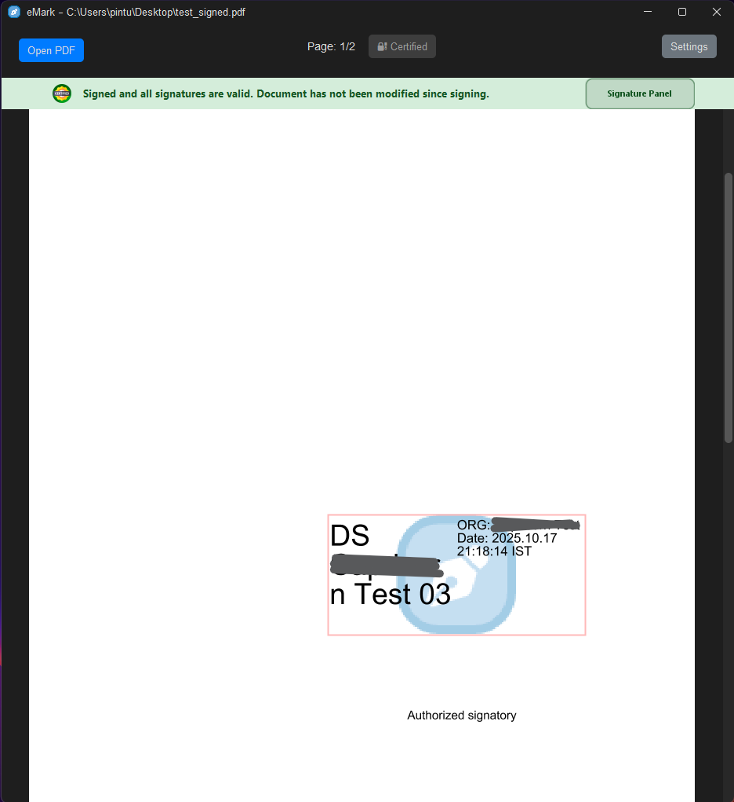
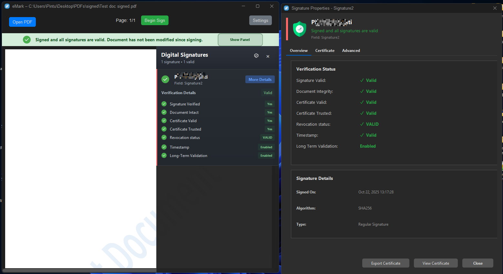
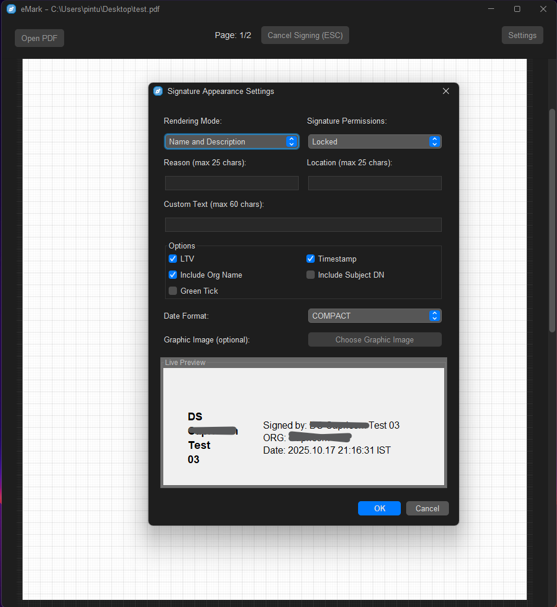

<div align="center">

# 🔐 eMark | Professional Adobe Reader DC Alternative for PDF Signing

[](https://www.gnu.org/licenses/agpl-3.0)
[](https://www.oracle.com/java/)
[](https://github.com/devcodemuni/eMark/releases)
[](https://github.com/devcodemuni/eMark/releases/latest)
[](https://github.com/devcodemuni/eMark/releases)
[](https://github.com/devcodemuni/eMark/stargazers)

### 🌐 **[Visit Official Website](https://devcodemuni.github.io/eMark/)** • **[Installation Guide](https://devcodemuni.github.io/eMark/installation.html)** • **[Download Now](https://github.com/devcodemuni/eMark/releases/latest)**



**Free • Open Source • Cross-Platform • Enterprise-Grade Security**

</div>

---

## 📖 Table of Contents

- [🎯 Overview](#-overview)
- [✨ Key Features](#-key-features)
- [🔒 Security & Compliance](#-security--compliance)
- [🚀 Quick Start](#-quick-start)
- [📥 Installation](#-installation)
- [🔐 Certificate & Signing Methods](#-certificate--signing-methods)
- [🆚 Comparison with Adobe Products](#-comparison-with-adobe-products)
- [🤝 Contributing](#-contributing)
- [📄 License](#-license)
- [🙏 Support & Community](#-support--community)

---

## 🎯 Overview

**eMark** is a **professional, free, and open-source PDF signing and verification application** designed as a powerful **Adobe Reader DC alternative**. It enables individuals, businesses, and government organizations to securely sign, verify, timestamp, and protect PDF documents with enterprise-grade security.

### 🌟 Why eMark?

- ✅ **Adobe Reader DC Compatible** - Signatures verified by Adobe products
- ✅ **100% Free & Open Source** - No hidden costs, licenses, or subscriptions
- ✅ **Multi-Platform** - Windows, Linux, macOS with consistent UI
- ✅ **Multi-Certificate Support** - USB tokens, HSM, smart cards, PKCS#11/12
- ✅ **Enterprise Security** - RFC 3161, LTV, PAdES compliant
- ✅ **Privacy-First** - 100% offline, no cloud upload, zero tracking
- ✅ **Professional Interface** - Adobe Reader-like experience with modern dark theme

### 🎯 Perfect For

| Sector | Use Case |
|--------|----------|
| 🏛️ **Government** | Tender submissions, official documents, DSC signing |
| ⚖️ **Legal** | Contracts, agreements, court documents, legally binding signatures |
| 💼 **Business** | Invoices, purchase orders, NDAs, contracts, vendor agreements |
| 🏥 **Healthcare** | Medical records, prescriptions |
| 🎓 **Education** | Certificates, transcripts, academic papers, research documents |

---

## ✨ Key Features

### 🔍 **PDF Signature Verification**



- **Comprehensive Verification** - Verify digital signatures with detailed validation status
- **Certificate Chain Validation** - Complete trust chain verification with CA certificate checks
- **Signature Integrity Checks** - Detect document modifications after signing
- **Visual Status Indicators** - Color-coded overlays (🟢 Valid, 🟡 Untrusted, 🔴 Invalid)
- **Adobe Reader Compatible** - Verify eMark-signed PDFs in Adobe Reader DC/Acrobat
- **Automatic Detection** - Instantly detect all signatures when opening PDFs
- **Detailed Certificate Info** - View issuer, subject, validity period, key usage, extensions
- **Timestamp Verification** - Validate RFC 3161 timestamps for long-term validity

### 🖋️ **PDF Digital Signing (*Existing Fields or New Fields*)**


- **Drag-and-Drop Placement** - Intuitive signature positioning anywhere on the page
- **Automatic Field Detection** - Recognize and sign existing PDF signature fields
- **Live Preview** - See signature appearance before applying
- **Customizable Appearance** - Add text, reason, location, date, custom images
- **Multiple Signatures** - Apply multiple signatures to single document
- **Signature Reason & Location** - Add metadata for legal compliance
- **Page Selection** - Sign specific pages or all pages

### 🔐 **Multi-Certificate Support**


| Certificate Type | Support | Description |
|-----------------|---------|-------------|
| **USB Tokens** | ✅ Full | eToken, SafeNet, Gemalto, Feitian, and more |
| **HSM (PKCS#11)** | ✅ Full | Hardware Security Modules with PKCS#11 interface |
| **PKCS#12/PFX** | ✅ Full | File-based certificates with private key |
| **Windows Certificate Store** | ✅ Full | Native Windows certificate integration |


### 🌐 **Cross-Platform Excellence**

- **Windows** - Native .exe installer, full Windows Certificate Store integration
- **Linux** - .deb package for Debian/Ubuntu, portable JAR for other distros
- **macOS** - Universal JAR with native look and feel
- **Consistent UI** - Same features and interface across all platforms
- **No Platform Lock-in** - Switch between OS without relearning

### 🎨 **Modern User Interface**


- **Dark Theme** - Elegant FlatMacDarkLaf theme for reduced eye strain
- **Collapsible Panels** - Signature properties panel for streamlined workflow
- **Interactive Overlays** - Visual signature indicators with click-to-verify
- **Floating Action Button** - Quick access to signing functions
- **Responsive Design** - Adapts to different screen sizes and resolutions
- **Intuitive Navigation** - Adobe Reader-familiar layout for easy adoption

### 🛡️ **Enterprise-Grade Security**

- **RFC 3161 Timestamping** - Trusted timestamp authority (TSA) support
- **Long-Term Validation (LTV)** - Embed validation data for future verification
- **Certificate Revocation** - OCSP and CRL checking
- **Password Protection** - Sign password-protected PDFs
- **Trust Management** - Import/manage trusted CA certificates
- **RSA** - Support for modern cryptographic key types

---

## 🔒 Security & Compliance

### 🛡️ **Cryptographic Security**

#### **Digital Signature Standards**
- ✅ **ISO 32000** (PDF specification) compliant
- ✅ **CAdES** (CMS Advanced Electronic Signatures) compatible
- ✅ **PKCS#7** signature format support
- ✅ **PKCS#11** v2.40 for hardware security devices
- ✅ **RFC 3161** timestamping protocol
- ✅ **RFC 5280** X.509 certificate validation
- ✅ **RFC 6960** OCSP (Online Certificate Status Protocol)

### 🏛️ **Compliance & Standards**

| Standard/Regulation | Compliance | Details |
|---------------------|-----------|----------|
| **DSC** | ✅ Full Support | Digital Signature Certificate (India) |

### 🔐 **Certificate Validation**

```
Certificate Validation Process:
┌─────────────────────────────────────┐
│ 1. Certificate Chain Verification   │ ✅ Root CA → Intermediate CA → End Entity
├─────────────────────────────────────┤
│ 2. Certificate Validity Period      │ ✅ Not Before ≤ Now ≤ Not After
├─────────────────────────────────────┤
│ 3. Certificate Revocation Check     │ ✅ OCSP and/or CRL validation
├─────────────────────────────────────┤
│ 4. Key Usage Verification           │ ✅ Digital Signature, Non-Repudiation
├─────────────────────────────────────┤
│ 5. Trust Anchor Validation          │ ✅ Trusted Root CA Store
├─────────────────────────────────────┤
│ 6. Signature Integrity Check        │ ✅ Hash comparison, no tampering
└─────────────────────────────────────┘
```

### 🔒 **Hardware Security Device Support**

#### **Tested USB Tokens & HSMs**
- ✅ **HYP2003** - HyperPKI 2003
- ✅ **ProxKey Token** - Watchdata Proxkey
- ✅ **Longmai** - mToken CryptoID
- ✅ **SOFT HSM** - soft HSM

#### **PKCS#11 Library Configuration**
eMark automatically detects common PKCS#11 libraries or allows manual configuration:
- Windows: `Using window keystore`
- Linux/macos: `wd_proxkey`, `mToken`

### 🔐 **Timestamp Authority (TSA) Support**

**Why Timestamping Matters:**
- ✅ Proves signature was created at a specific time
- ✅ Extends signature validity beyond certificate expiration
- ✅ Legal requirement in many jurisdictions
- ✅ Prevents backdating attacks

**Supported TSA Protocols:**
- RFC 3161 compliant timestamp servers
- HTTP and HTTPS timestamp requests
- Proxy server support for corporate environments

**Popular Free TSA Servers:**
- DigiCert TSA: `http://timestamp.digicert.com`
- Sectigo TSA: `http://timestamp.sectigo.com`

---

## 🚀 Quick Start

### 📋 **Prerequisites**

```bash
# Java 8 (JRE or JDK) is REQUIRED
# Check your Java version:
java -version

# Expected output:
# java version "1.8.0_xxx"
# Java(TM) SE Runtime Environment (build 1.8.0_xxx-bxx)
```

<div style="background-color:#1E1E2F; border-left:6px solid #FBBF24; padding:20px; border-radius:8px; color:#F3F4F6; font-family:Arial, sans-serif; box-shadow:0 4px 12px rgba(0,0,0,0.3);">
  <strong style="font-size:18px;">⚠️ Important:</strong>
  <ul style="margin-top:12px; margin-left:20px; font-size:16px; line-height:1.6; list-style-type: disc;">
    <li><strong>Java 8 (1.8.x) required:</strong> Fully tested on Java 8 for optimal performance.</li>
    <li><strong>Compatible with JDK & JRE:</strong> eMark runs smoothly on both Java Development Kit (JDK) and Java Runtime Environment (JRE) 8.</li>
    <li><strong>Not supported:</strong> Java 7 or versions above Java 8 (Java 9+).</li>
  </ul>
</div>


### 📥 **Quick Installation**

#### **Windows**
```bash
# Download and run the .exe installer
1. Download: eMark-Setup-v1.1.0.exe
2. Double-click to install
3. Launch eMark from Start Menu
```

#### **Linux (Debian/Ubuntu)**
```bash
# Download and install .deb package
wget https://github.com/devcodemuni/eMark/releases/latest/download/eMark-v1.1.0.deb
sudo dpkg -i eMark-v1.1.0.deb

# Or use JAR file
java -jar eMark-v1.1.0.jar
```

#### **macOS**
```bash
# Use universal JAR file
java -jar eMark-v1.1.0.jar
```

---

## 📥 Installation

### **Option 1: Download Pre-Built Release** (Recommended)

[](https://github.com/devcodemuni/eMark/releases/latest)

**Available Packages:**
- 🪟 **Windows** - `.exe` installer (64-bit)
- 🐧 **Linux** - `.deb` package (Debian/Ubuntu)
- 📦 **Universal** - `.jar` file (all platforms)

### **System Requirements**

| Component | Minimum | Recommended |
|-----------|---------|-------------|
| **OS** | Windows 7 / Ubuntu 18.04 / macOS 10.13 | Windows 10/11 / Ubuntu 22.04 / macOS 12+ |
| **Java** | Java 8 (1.8.0) | Java 8 (latest update) |
| **RAM** | 512 MB | 1 GB+ |
| **Disk Space** | 100 MB | 200 MB+ |
| **Screen** | 1024x768 | 1920x1080+ |
| **Hardware** | Optional USB token/smart card reader | USB token with PKCS#11 support |

---

## 🔐 Certificate & Signing Methods

### 🔑 **1. USB Token / HSM (PKCS#11)**

**Best For:** Maximum security, government/legal documents, corporate environments

**Advantages:**
- ✅ Private key never leaves hardware device
- ✅ PIN-protected access
- ✅ Tamper-resistant hardware
- ✅ Meets highest security standards
- ✅ Multi-certificate storage

**Setup:**
1. Install token driver from manufacturer
2. Configure PKCS#11 library path in eMark
3. Insert token and enter PIN
4. Select certificate and sign


### 📄 **2. PKCS#12/PFX Certificate File**

**Best For:** Personal use, testing, development

**Advantages:**
- ✅ Easy to use and portable
- ✅ No hardware required
- ✅ Password-protected
- ✅ Works on any platform

**Setup:**
1. Obtain .pfx or .p12 certificate file
2. In eMark: File → Import PKCS#12
3. Enter password when prompted
4. Certificate ready for signing

**Security Note:**
- ⚠️ Private key stored in software (less secure than hardware)
- ⚠️ Protect .pfx file with strong password
- ⚠️ Store on encrypted drive

### 🪟 **3. Windows Certificate Store**

**Best For:** Windows enterprise environments, Active Directory

**Advantages:**
- ✅ Native Windows integration
- ✅ Centralized management
- ✅ Single sign-on (SSO) compatible
- ✅ Group Policy deployment

**Certificate Locations:**
- `certmgr.msc` - User certificates
- `Personal → Certificates`

---

## 🛡️ Privacy & Data Protection

### 🔒 **Zero Data Collection**

eMark is designed with **privacy-first** principles:

```
┌─────────────────────────────────────────────┐
│  What eMark NEVER Does:                     │
├─────────────────────────────────────────────┤
│  ❌ Upload PDFs to cloud servers            │
│  ❌ Send data to external servers           │
│  ❌ Track user behavior or analytics        │
│  ❌ Store signing history externally        │
│  ❌ Collect personal information            │
│  ❌ Share certificates or keys              │
│  ❌ Phone home or check licenses            │
│  ❌ Display advertisements                  │
└─────────────────────────────────────────────┘
```

### 🌐 **100% Offline Operation**

- ✅ All PDF processing happens **locally** on your computer
- ✅ Private keys **never leave** hardware security devices
- ✅ No internet connection required (except for optional OCSP/timestamp)
- ✅ Complete **air-gap** deployment supported
- ✅ Works in secure/classified environments

### 🔐 **GDPR Compliance**

As an open-source, offline application:
- ✅ **No personal data collection** - Nothing to report or delete
- ✅ **Data controller independence** - You control all data
- ✅ **No third-party sharing** - Data never leaves your premises
- ✅ **Transparent processing** - Open-source code auditable
- ✅ **Right to audit** - Full source code available

### 🔒 **Secure by Design**

**Memory Security:**
- Sensitive data (PINs, passwords) cleared from memory after use
- No sensitive data written to disk/swap
- Secure random number generation

**Certificate Security:**
- Private keys accessed only through secure APIs
- PIN/password never stored permanently
- Hardware token PINs never exposed to application

**File Security:**
- Original PDFs never modified (new file created)
- Temporary files securely deleted
- No backup copies in hidden folders

---

### 🔧 **Technology Stack**

| Component | Technology | Version | Purpose |
|-----------|-----------|---------|---------|
| **Language** | Java | 8 (1.8) | Core application |
| **UI Framework** | Swing | Built-in | User interface |
| **Look & Feel** | FlatLaf | 3.x | Modern dark theme |
| **PDF Library** | Apache PDFBox | 2.x | PDF rendering/viewing |
| **Signing Engine** | iText 5 | 5.5.x | PDF digital signatures |
| **Crypto Provider** | Bouncy Castle | 1.70+ | Cryptographic operations |
| **PKCS#11** | Sun PKCS#11 | Built-in | Hardware token support |
| **Build Tool** | Maven | 3.x | Project management |

### 📦 **Dependencies**

```xml
<!-- Core Dependencies -->
<dependency>
    <groupId>com.itextpdf</groupId>
    <artifactId>itextpdf</artifactId>
    <version>5.5.13.3</version>
</dependency>

<dependency>
    <groupId>org.bouncycastle</groupId>
    <artifactId>bcprov-jdk15on</artifactId>
    <version>1.70</version>
</dependency>

<dependency>
    <groupId>org.apache.pdfbox</groupId>
    <artifactId>pdfbox</artifactId>
    <version>2.0.27</version>
</dependency>

<dependency>
    <groupId>com.formdev</groupId>
    <artifactId>flatlaf</artifactId>
    <version>3.2.5</version>
</dependency>
```

---

## 🆚 Comparison with Adobe Products

### 📊 **Feature Comparison**

| Feature                       | eMark                  | Adobe Acrobat DC         |
| ----------------------------- | ---------------------- |--------------------------|
| **Price**                     | 🟢 Free Forever        | 🔴 Subscription required |
| **Open Source**               | 🟢 Yes (AGPL 3.0)      | 🔴 Proprietary           |
| **PDF Signing**               | 🟢 Full Support        | 🟢 Full Support          |
| **Signature Verification**    | 🟢 Yes                 | 🟢 Yes                   |
| **USB Token/HSM (PKCS#11)**   | 🟢 Yes                 | 🟢 Yes                   |
| **Windows Certificate Store** | 🟢 Yes                 | 🟢 Yes                   |
| **PKCS#12/PFX**               | 🟢 Yes                 | 🔴 No                    |
| **Cross-Platform**            | 🟢 Windows/Linux/macOS | 🟡 Windows/macOS         |
| **Timestamp (RFC 3161)**      | 🟢 Yes                 | 🟢 Yes                   |
| **LTV Support**               | 🟢 Yes                 | 🟢 Yes                   |
| **Batch Signing**             | 🟢 Yes                 | 🟢 Yes                   |
| **Custom Appearance**         | 🟢 Yes                 | 🟢 Yes                   |
| **Offline Operation**         | 🟢 100% Offline        | 🟡 Requires Login        |
| **Privacy**                   | 🟢 Zero Tracking       | 🔴 Analytics/Telemetry   |
| **Source Code**               | 🟢 Available           | 🔴 Closed Source         |

---

## 🔧 Troubleshooting

### 🚨 **Common Issues & Solutions**

#### ❌ **Java Version Error**
```bash
Error: Unsupported Java version

Solution:
1. Check Java version: java -version
2. Expected: java version "1.8.0_xxx"
3. Download Java 8: https://www.oracle.com/java/technologies/javase/javase8-archive-downloads.html
```

#### ❌ **Certificate Not Detected**
```
Problem: USB token certificate not appearing

Solution:
1. Install token driver from manufacturer
2. Verify token is inserted properly
3. Check PKCS#11 library path in Settings
4. Restart eMark after configuring
5. Test with: certutil -scinfo (Windows) or pkcs11-tool -L (Linux)
```

#### ❌ **PDF Loading Issues**
```
Problem: PDF fails to open or displays incorrectly

Solution:
1. Verify PDF is not corrupted (open in another viewer)
2. Check if PDF is password-protected (enter password)
3. Ensure file permissions allow reading
4. Try re-saving PDF with "Save As" in another viewer
5. Check PDF version (PDF 1.4-2.0 supported)
```

#### ❌ **Signature Verification Failed**
```
Problem: Signature shows as invalid or untrusted

Solution:
1. Import CA certificate to trust store (Settings → Trust Certificates)
2. Check internet connection for OCSP/CRL validation
3. Verify certificate hasn't expired
4. Ensure certificate chain is complete
5. Add timestamp server certificate to trust store
```

#### ❌ **PIN Entry Issues**
```
Problem: Token PIN not accepted

Solution:
1. Verify correct PIN with token manufacturer app
2. Check if token is locked (too many wrong attempts)
3. Try unplugging and replugging token
4. Update token drivers
5. Test token with manufacturer's software first
```

---

## 🤝 Contributing

We welcome contributions from the community! 🎉

### 🌟 **Ways to Contribute**

- 🐛 **Report Bugs** - Help us improve by reporting issues
- 💡 **Suggest Features** - Share your ideas for new features
- 📝 **Improve Documentation** - Help others understand eMark
- 🔧 **Submit Code** - Fix bugs or implement features
- 🌐 **Translations** - Help make eMark multilingual
- ⭐ **Star the Project** - Show your support

### 📋 **Before Contributing**

1. Read our [Contributing Guidelines](CONTRIBUTING.md)
2. Check [existing issues](https://github.com/devcodemuni/eMark/issues)
3. Fork the repository
4. Create a feature branch
5. Make your changes
6. Submit a pull request

### 🐛 **Reporting Bugs**

When reporting bugs, please include:
- Operating system and version
- Java version (`java -version`)
- eMark version
- Steps to reproduce
- Expected vs actual behavior
- Error logs or screenshots

### 💡 **Feature Requests**

For feature requests, please describe:
- The problem you're trying to solve
- Your proposed solution
- Why this would be valuable to users
- Any alternative solutions considered

---

## 🔒 Security

### 🛡️ **Security Policy**

We take security seriously. If you discover a security vulnerability:

**⚠️ DO NOT** open a public GitHub issue.

Instead:
1. Email: [Create a security advisory on GitHub]
2. Provide detailed information about the vulnerability
3. Include steps to reproduce (if applicable)
4. Allow reasonable time for a fix before public disclosure

### 🔐 **Security Best Practices**

When using eMark:
- ✅ Always use strong PINs/passwords for tokens and certificates
- ✅ Keep USB tokens physically secure
- ✅ Regularly update Java to latest Java 8 version
- ✅ Only download eMark from official GitHub releases
- ✅ Verify signature of downloaded files (if provided)
- ✅ Use hardware tokens for sensitive documents
- ✅ Enable timestamping for long-term validity
- ✅ Regularly backup certificates and private keys (encrypted)

---

## 📄 License

This project is licensed under the **GNU Affero General Public License v3.0 (AGPL-3.0)**.

### 📜 **License Summary**

```
eMark - Professional PDF Signing Software
Copyright (C) 2025 Codemuni

This program is free software: you can redistribute it and/or modify
it under the terms of the GNU Affero General Public License as published
by the Free Software Foundation, either version 3 of the License, or
(at your option) any later version.

This program is distributed in the hope that it will be useful,
but WITHOUT ANY WARRANTY; without even the implied warranty of
MERCHANTABILITY or FITNESS FOR A PARTICULAR PURPOSE. See the
GNU Affero General Public License for more details.
```

### ✅ **What This Means (AGPL 3.0)**

Under the **AGPL 3.0 license**:

**You CAN:**

* ✅ Run eMark for any purpose, including personal, organizational, or commercial use
* ✅ Modify the source code for your own use
* ✅ Share or distribute eMark (modified or unmodified) **as long as the source code is made available under the AGPL**
* ✅ Deploy eMark over a network (e.g., SaaS) **if you provide access to the source code**

**You CANNOT:**

* ❌ Distribute it under a proprietary license
* ❌ Remove copyright or license notices
* ❌ Keep modifications private if you make the software available to others (over a network or distribution)
* ❌ Hold authors liable
* ❌ Use authors' names for promotion without permission

---

**You MUST:**
- ⚠️ Disclose source code of modifications
- ⚠️ Include original license and copyright
- ⚠️ State changes made to the code
- ⚠️ Make modified source available (if distributed)
- ⚠️ Use same AGPL-3.0 license for derivatives


**Network Use:**
- If you modify eMark and run it as a network service, you must make the source code available to users.

See [LICENSE](LICENSE) file for full details.

---

## 🙏 Support & Community

### 💬 **Get Help**

- 🌐 **Website**: [devcodemuni.github.io/eMark](https://devcodemuni.github.io/eMark/)
- 📖 **Documentation**: [Installation Guide](https://devcodemuni.github.io/eMark/installation.html)
- 🐛 **Bug Reports**: [GitHub Issues](https://github.com/devcodemuni/eMark/issues)
- 💡 **Feature Requests**: [GitHub Discussions](https://github.com/devcodemuni/eMark/discussions)
- 📧 **Email**: [Create an issue on GitHub]

### 🌟 **Show Your Support**

If eMark has helped you, please consider:
- ⭐ **Star the repository** on GitHub
- 🐦 **Share on social media** with #eMark
- 📝 **Write a blog post** about your experience
- 🎥 **Create a tutorial** video
- 💬 **Recommend** to colleagues and friends

### 🙏 **Acknowledgments**

eMark is built on the shoulders of giants. Special thanks to:

- **[Apache PDFBox](https://pdfbox.apache.org/)** - PDF rendering and manipulation
- **[iText 5](https://github.com/itext/itextpdf)** - PDF digital signature creation
- **[Bouncy Castle](https://www.bouncycastle.org/)** - Cryptography provider
- **[FlatLaf](https://www.formdev.com/flatlaf/)** - Modern Swing look and feel
- **All contributors** who have helped improve eMark

### 📊 **Project Statistics**

[](https://github.com/devcodemuni/eMark/stargazers)
[](https://github.com/devcodemuni/eMark/network/members)
[](https://github.com/devcodemuni/eMark/issues)
[](https://github.com/devcodemuni/eMark/pulls)

---

## 📸 Gallery

### 🖼️ **Screenshots**

<details>
<summary>Click to expand screenshot gallery</summary>

#### Main Interface


#### PDF Viewer with Signature Detection


#### Signature Field Detection


#### Certificate Selection


#### Signature Appearance Customization


#### Signature Properties


#### Keystore Settings


#### Security Settings


</details>

For more screenshots and detailed documentation, visit:
- 📸 [Image Gallery](docs/image-gallery.md)
- 🗺️ [Architecture Diagrams](docs/diagram.md)

---

<div align="center">

## ⭐ Star History

[](https://star-history.com/#devcodemuni/eMark&Date)

---

## 📢 Spread the Word

If you find eMark useful, please help spread the word:

[](https://twitter.com/intent/tweet?text=Check%20out%20eMark%20-%20Free%20Adobe%20Reader%20DC%20Alternative%20for%20PDF%20Signing!&url=https://github.com/devcodemuni/eMark&hashtags=eMark,PDFSigning,OpenSource)

---

### 🔐 **Made with ❤️ for Secure PDF Signing and Open-Source Freedom**

**[⭐ Star on GitHub](https://github.com/devcodemuni/eMark)** • **[🐛 Report Issues](https://github.com/devcodemuni/eMark/issues)** • **[🤝 Contribute](CONTRIBUTING.md)** • **[📥 Download](https://github.com/devcodemuni/eMark/releases/latest)**

---

© 2025 eMark Project • Licensed under AGPL-3.0 • [Privacy Policy](https://devcodemuni.github.io/eMark/) • [Terms of Use](https://devcodemuni.github.io/eMark/)

**Keywords:** PDF signer, digital signature, Adobe Reader DC alternative, Adobe Acrobat alternative, USB token, HSM, PKCS#11, PKCS#12, Windows certificate store, cross-platform, open source, free PDF signing, electronic signature, e-signature, document signing, certificate-based signing, timestamp, LTV, PAdES, enterprise security, privacy-focused, offline PDF signer

</div>