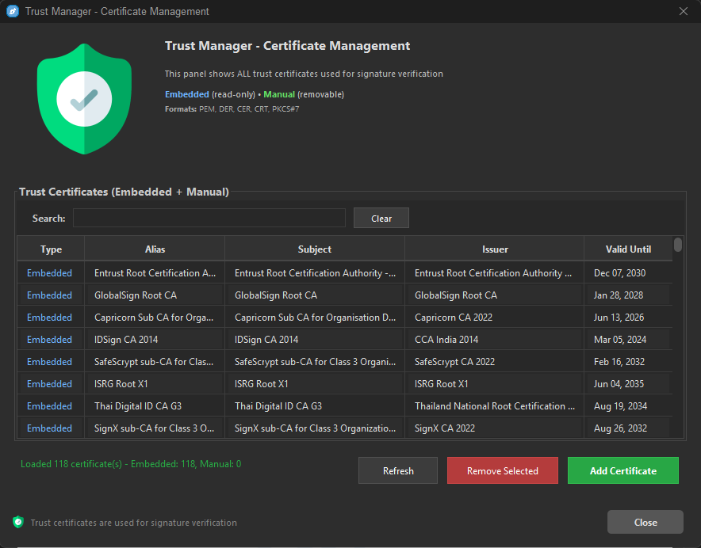

# eMark - Image Gallery

This document showcases the different screens and features of the eMark application through images, following the natural workflow of the application.

## Application Overview

### Main Window

*The main window of the eMark application*

## Signature Workflow

### Initial Signature Operation

*Starting a new signature operation*

### PDF View

*Viewing a PDF document before signing*

### Signature Field Detection

*Automatically detecting and signing existing signature fields*

### Signature Box Rectangle

*Creating a signature box with rectangle tool*

### Signature Panel

*Collapsible signature properties panel for customizing signature appearance*

### Signature Appearance

*Customizing the appearance of the digital signature*

### Signature Properties

*Viewing detailed signature information and verification status*

## Certificate Management

### Certificate Selection

*Selecting a digital certificate for signing*

### Trust Manager

*Managing trusted certificates and security settings*

## Application Settings

### Security Settings

*Configuring security-related settings*

### Keystore Settings

*Managing keystore and certificate settings*

## Document Operations

### Save Signed File

*Saving the signed document to a new file*

### Signed PDF View

*Viewing the document after successful signing*
