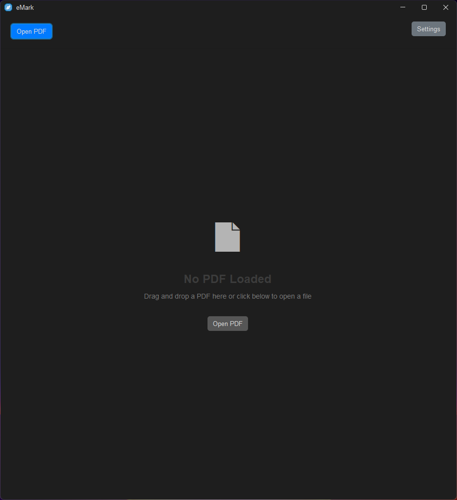
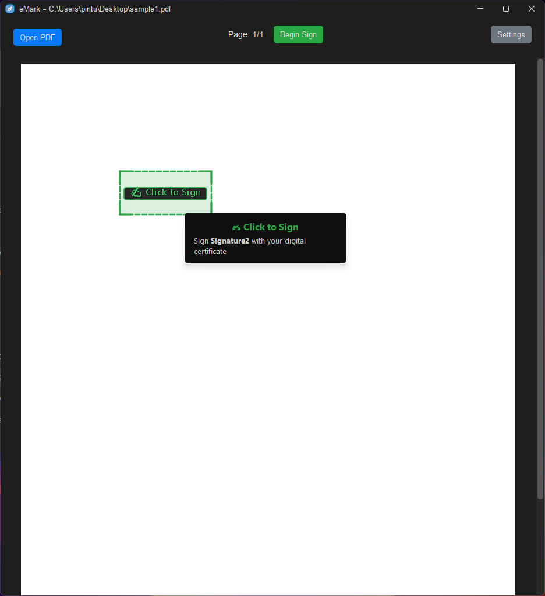
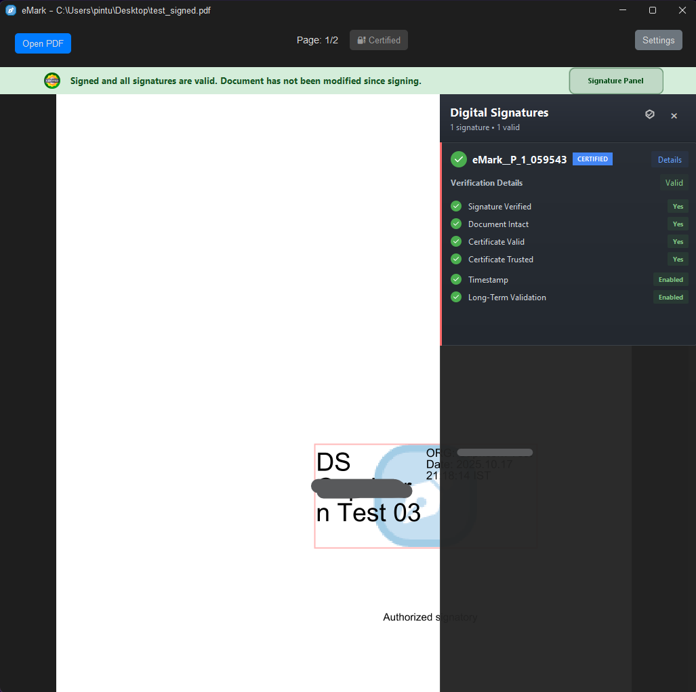

# eMark - Image Gallery

This document showcases the different screens and features of the eMark application through images.

## Main Application

### Main Window

*The main window of the eMark application*

## Document Signing

### PDF View

*Viewing a PDF document before signing*

### Signature Field Detection

*Automatically detect and sign existing signature fields with Adobe Reader-like interface*

### Signature Panel

*Collapsable signature properties panel for customizing signature appearance*

### Signature Appearance

*Customizing the appearance of the digital signature*

### Signature Properties

*View detailed signature information and verification status*

## Certificate Management

### Certificate Selection

*Selecting a digital certificate for signing*

## Settings

### Security Settings

*Configuring security-related settings*

### Keystore Settings

*Managing keystore and certificate settings*

## File Operations

### Save Signed File

*Saving the signed document to a new file*
